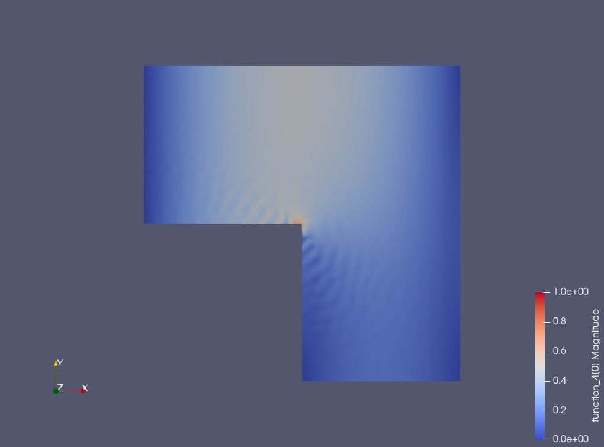
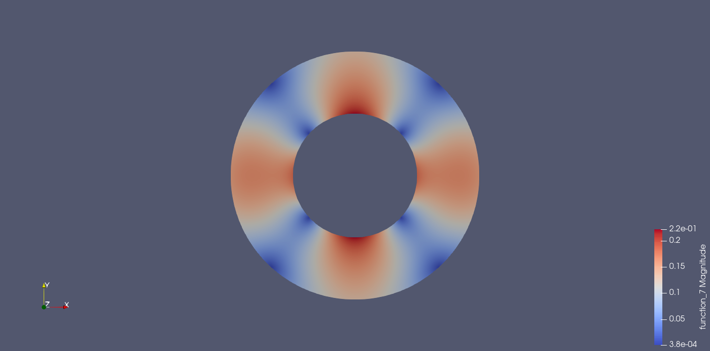
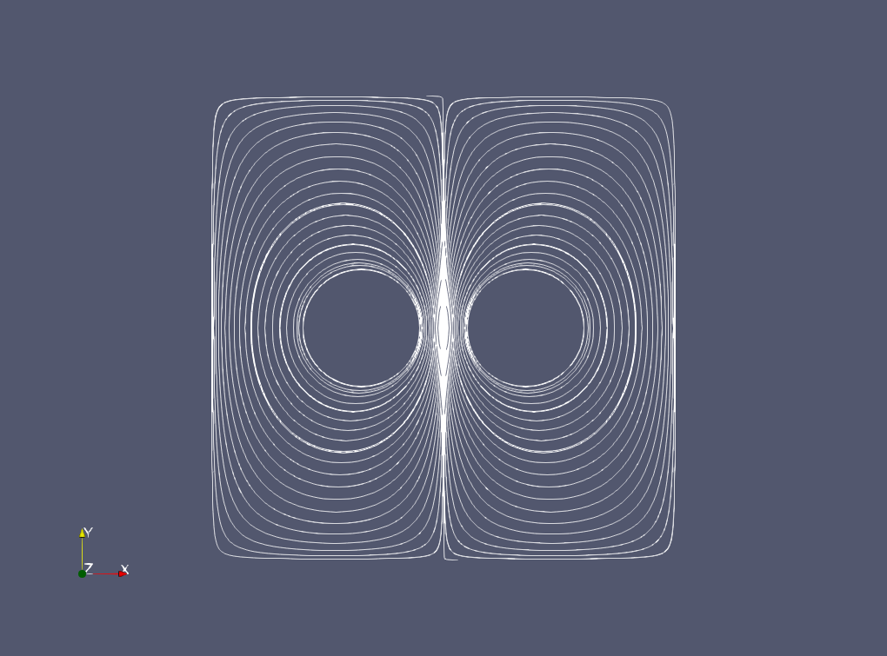
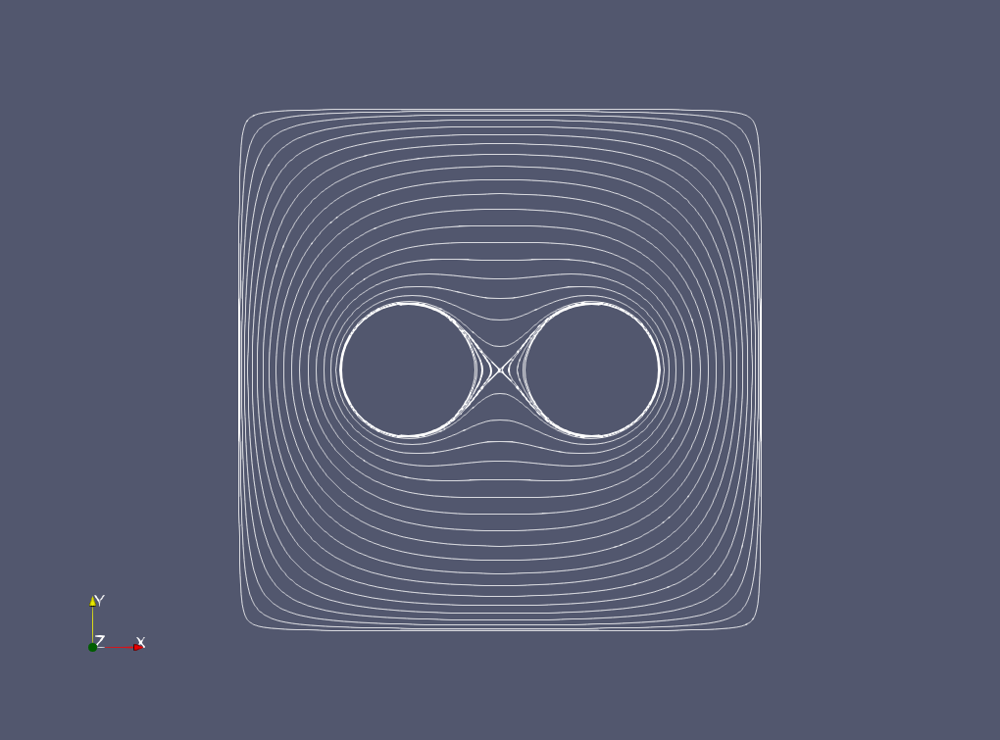
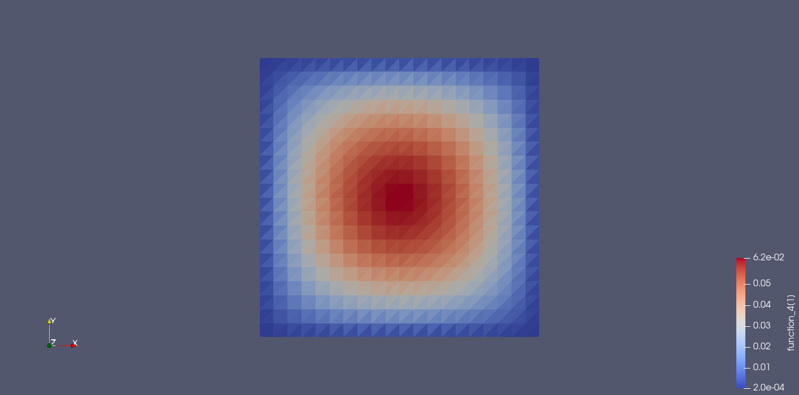
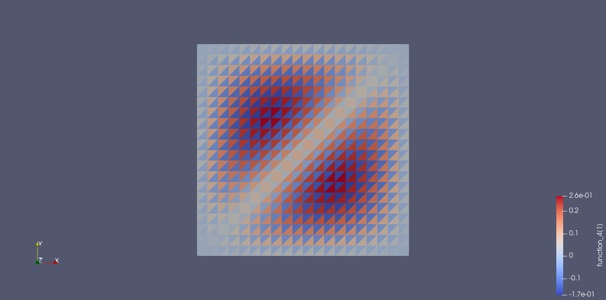

# Finite-element-exterior-calculus
Repository for FEEC material e.g. Firedrake examples.

# Finite element exterior calculus in Firedrake

These are some simple Firedrake examples of the use of finite element exterior calculus as presented in the textbook Finite Element Exterior Calculus by D.N. Arnold.

All current examples (bar k_equals_2_Hodge_Laplacian_square.py) are cases of the vector Laplacian on a planar two-dimensional domain subject to u \cdot n = curl u \times n = 0 on the boundaries.

Unless indicated in the descriptions below, the .msh file has the same filename as the script.

**re-entrant_corner.py** - Laplacian problem with source on a L-shaped domain containing a 90 degree re-entrant corner.  Theory indicates in the continuous solution a r^{-1/3} singularity at distance r from the corner and the numerical challenge is to resolve this singularity without spurious oscillations.

**re-entrant_corner.py** - problem as **re-entrant_corner.py** but attempted using primal formulation.  Converges to an incorrect answer due to the inability of the function space to represent the re-entrant corner singularity.

**source_problem_on_annulus.py** - Laplacian problem with source on an annular domain.  The numerical challenge is to avoid pollution of the output by the 1-cohomology of the vector Laplacian on the domain (represented by the usual (-y/r^2, -x/r^2) vortex solution).  Includes analytic solution to the problem for comparison with output.

**eigenvalue_problem_single_vortex.py** - eigenvalue problem to find the 1-cohomology of the vector Laplacian on the annulus (same domain as source_problem_on_annulus.py script and the zero-eigenvalue mode is the vortex described for that example).  Output best viewed as streamline plot.

**eigenvalue_problem_double_vortex.py** - slightly more interesting eigenvalue problem to find the 1-cohomology of the vector Laplacian on a square with two holes removed.  The two zero-eigenvalue modes correspond roughly (but not precisely) to the cases of a co-rotating and a counter-rotating vortex pair (the solver does not find the pure co-/counter-rotating modes but rather linear combinations thereof).  Output best viewed as streamline plot.

**eigenvalue_problem_square_vortex.py** - eigenvalue problem, similar to eigenvalue_problem_single_vortex.py but on a square domain with a non-centred square hole.  Has re-entrant corner singularities (r^{-1/3}) and also non-trivial cohomology.  Amplitude plot shows corner singularities; streamline plot shows ... streamlines.

**square_vortex_cohomology_alternate.py** - solves problem of finding zero-eigenvalue mode of square + square hole as in eigenvalue_problem_square_vortex.py but using an alternate method (no FEEC needed, just conventional FEM).  Treats problem as deformation of a circular vortex by a gradient.

**double_vortex_cohomology_alternate.py** - solves problem of finding zero-eigenvalue modes of square + 2 circular holes as in eigenvalue_problem_double_vortex.py (uses same .msh file as that example) but using an alternate method (no FEEC needed, just conventional FEM).  Treats problem as deformation of analytic double vortex solutions by gradients.

**k_equals_2_Hodge_Laplacian_square.py** - solves k=2 Hodge Laplacian on square, demonstrating some function spaces that work and some that don't.  Taken from "Finite Element Exterior Calculus: from Hodge Theory to Numerical Stability" (arXiv:0906.4325v3) by Arnold, Falk, Winther; S.2.3.1 p.14, where a lucid discussion can be found.  Note this is self-contained example with no attendant .msh file.

The help of Colin Cotter, Patrick Farrell, and Lawrence Mitchell is acknowledged.  Any mistakes are due to the author (Ed Threlfall). 
